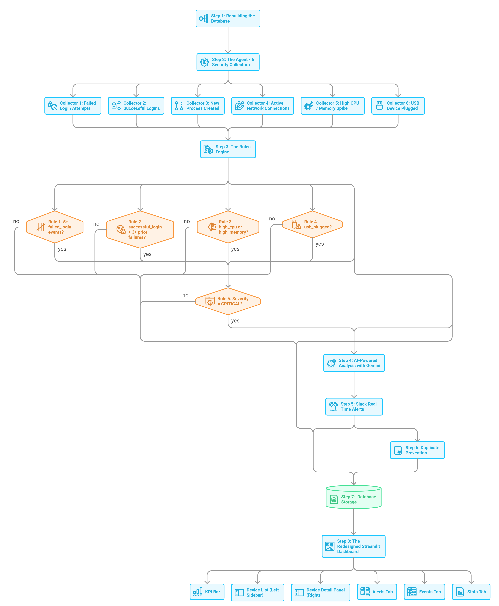

# 🛡️ Agentic SIEM Solution

> From a simple hostname tracker to a full **event collection pipeline** with AI analysis, Slack alerts, and a live multi-device SOC dashboard.

##  About

This project is a lightweight but **real agentic SIEM (Security Information and Event Management)** system. A Python agent runs on any device (Windows/Linux/macOS), autonomously collects security events every 3 minutes, applies a rules engine, uses **Google Gemini AI** for analysis, sends **Slack alerts**, and pushes everything to a **Supabase PostgreSQL** database — all visualized in a live **Streamlit SOC dashboard**.

##  Architecture
 

**3 Layers:**

| Layer | Component | Description |
|-------|-----------|-------------|
| **Layer 1 — Agent** | `agent.py` | Single Python file; polls every 3 min, 6 collectors, rules engine, AI, Slack |
| **Layer 2 — Database** | Supabase PostgreSQL | Stores `devices`, `events`, `alerts` tables |
| **Layer 3 — Visibility** | Streamlit + Slack | Live SOC dashboard + real-time color-coded Slack notifications |

##  Tech Stack

| Category | Technology |
|----------|-----------|
| **Agent** | Python (`psutil`, `psycopg2-binary`, `requests`, `openai`, `geocoder`) |
| **Database** | Supabase PostgreSQL |
| **Dashboard** | Streamlit |
| **AI Analysis** | Google Gemini (OpenAI-compatible API) |
| **Alerting** | Slack Webhooks |
| **Geolocation** | Public IP geocoder |
| **Deduplication** | In-memory event hash |

##  Agentic Capabilities

The agent runs **autonomously** with no human interaction required:

### 6 Event Collectors (every 3 min)
-  Failed login attempts
-  Successful logins
-  New processes (via `psutil`)
-  Network connections (via `psutil`)
-  High CPU / Memory usage (via `psutil`)
-  USB device plug events

### Rules Engine
| Rule | Severity |
|------|----------|
| 5+ failed logins | 🔴 CRITICAL |
| Successful login + 3+ prior failures | 🟠 HIGH |
| High CPU / Memory threshold breach | 🟠 HIGH |
| USB device plugged | 🟡 MEDIUM |

### AI-Powered Analysis
For **HIGH** and **CRITICAL** events, Google Gemini generates SOC analyst-style summaries automatically.

##  Dashboard Features

**Live dashboard:** [https://agentic-siem-solution.streamlit.app/](https://agentic-siem-solution.streamlit.app/)

| Feature | Description |
|---------|-------------|
| **KPI Bar** | Total Devices, Total Events, Critical/High counts, Open Alerts |
| **Device List (Sidebar)** | Clickable cards — Hostname, Public IP + Location, Open alert count |
| **Device Detail Panel** | Hostname, IP, Location, Timezone, OS, Registered At, Total Events, Open Alerts |
| **Alerts Tab** | Color-coded cards 🔴 Critical / 🟠 High / 🟡 Medium / 🟢 Low |
| **Events Tab** | Full log with Severity & Event Type filters + dataframe view |
| **Stats Tab** | Bar charts — Events by Severity and Events by Type |

##  Read the Full Story

I wrote a detailed walkthrough on Medium about how I built this — from a simple hostname tracker to a full agentic SIEM:

 [I Turned My Tiny SIEM Dashboard Into a Real Agentic Security Monitoring System](https://medium.com/@sufia-thesecuredev/i-turned-my-tiny-siem-dashboard-into-a-real-agentic-security-monitoring-system-7d61df40f9d7)

##  A quick overview
I also make an overview video and you can see in my youtube channel.

##  Author

**Sufia TheSecureDev**
- Medium: [@sufia-thesecuredev](https://medium.com/@sufia-thesecuredev)
- GitHub: [@Sufia-TheSecureDev](https://github.com/Sufia-TheSecureDev)

---

## ⭐ If you find this useful, give the repo a star!

